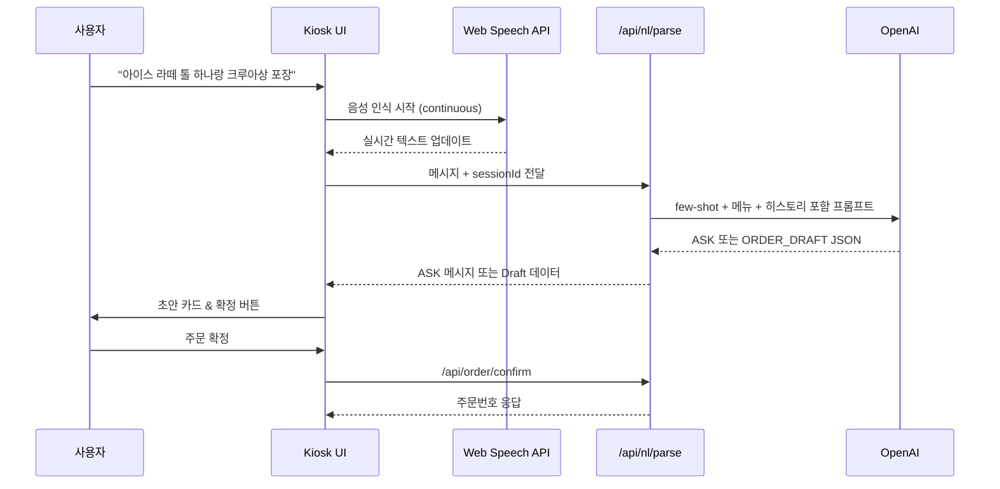

# Malro Kiosk MVP 발표 가이드

발표용 슬라이드 구성 시 참고할 핵심 메시지, 아키텍처 다이어그램, LLM 전략 요약을 한 곳에 정리했습니다. 아래 순서를 참고하여 PPT 슬라이드를 제작하면 됩니다.

---

## 1. 한눈에 보는 메시지
- **음성 기반 주문**: Web Speech API로 실시간 STT → 텍스트를 즉시 입력창에 반영, 버튼 한 번으로 AI 파이프라인 호출.
- **LLM 주문 정리**: OpenAI Chat Completions + Zod 검증으로 ASK/ORDER_DRAFT JSON을 안정적으로 생성.
- **키오스크 UX**: Next.js 기반 UI와 NestJS 백엔드, Nginx 단일 도메인(`https://malro.cccv.to`)으로 실제 매장처럼 작동.

---

## 2. 시스템 구성 슬라이드
- **프런트**: Next.js 14 + Tailwind, kiosk/admin 두 페이지, Web Speech API(STT) 연동.
- **서버**: NestJS + Prisma + SQLite. `nl.service.ts`가 LLM 호출 및 룰 기반 폴백 담당.
- **아티팩트**: `artifacts/cafe/*` 내 메뉴, aliases, few-shot, manifest를 Zod로 검증.
- **인프라**: AWS EC2 (t3.small), Docker Compose (web/server/nginx), Route53 + TLS.
- **Nginx**: `/api/*` → server(4000), 그 외 → web(3000), HTTPS Termination.

---

## 3. 전체 아키텍처 (Mermaid)
```mermaid
flowchart LR
    User[사용자] -->|음성 입력| Browser[Next.js Kiosk<br/>Web Speech API]
    Browser -->|텍스트/세션 ID| API[/api/nl/parse<br/>Nginx/HTTPS/443/]
    API -->|Reverse Proxy| Server[NestJS Server<br/>NL Service]
    Server -->|메뉴/퓨샷 로드| Artifacts[(Artifacts: menu.json,<br/>aliases.json,<br/>few_shots.jsonl)]
    Server -->|OpenAI Chat Completions| OpenAI[(LLM)]
    Server -->|ORDER_DRAFT/ASK| Browser
    Browser -->|confirmOrder| OrderAPI[/api/order/confirm/]
    OrderAPI --> Prisma[(Prisma + SQLite)]
    Browser --> Admin[Admin Dashboard<br/>(실시간 주문 현황)]
```

---

## 4. 사용자 여정 / 데모 시나리오


---

## 5. LLM 전략 요약 (docs/Strategy for using LLM.md 기반)
### Prompt 구성
1. **System Prompt**: 메뉴 버전/해시, ASK & ORDER_DRAFT 스키마, 메뉴 외 생성 금지 규칙.
2. **Few-shot (10개)**: 멀티 주문, 디저트, 옵션, ASK 사례를 JSON 포맷으로 제공.
3. **대화 이력**: `ConversationStore`가 user/assistant 메시지를 JSON 그대로 저장, 최근 8~12개를 prompt에 포함.
4. **실시간 사용자 발화**: STT 또는 텍스트 입력 결과.

### 아티팩트 & 컨텍스트
- `menu.json`: 핵심 10개 메뉴만 남겨 토큰/지연 최적화.
- `aliases.json`: STT 오류 대비 별칭(예: “카페못가” → CAFE_MOCHA).
- `few_shots.jsonl`: 10개 예시, `artifact_manifest.json`에서 카운트 검증.

### 가드레일 & 폴백
- Zod 스키마(`LlmResponseSchema`)로 모든 응답 검증, `normalizeLlmPayload()`로 data 누락 보정.
- LLM 호출 실패 시 룰 기반 파서가 `ASK`/`ORDER_DRAFT` 재구성.
- `orderType` 미제공 시 TAKE_OUT 기본값.
- `ConversationStore`에 assistant 메시지를 JSON Raw로 저장해 다회차 요청 시 문맥 손실 최소화.

---

## 6. 인프라 & 배포 슬라이드 포인트
- **환경**: EC2(Ubuntu 22.04) + Docker Compose(3 컨테이너).
- **도메인**: Route53 → `malro.cccv.to`, Nginx가 TLS 종료 (`infra/nginx.conf`).
- **데이터**: `data/sqlite` 볼륨에 Prisma SQLite 유지, `prisma db push`를 컨테이너 시작 시 실행.
- **환경변수**: `.env` 공유, `OPENAI_API_KEY`, `OPENAI_MODEL`, `NEXT_PUBLIC_API_BASE_URL=https://malro.cccv.to/api`.
- **운영 체크**: `pnpm approve-builds`, 인증서 갱신 시 `docker compose restart nginx`.

---

## 7. 데모 체크리스트
1. `docker compose up -d --build` 가 성공했는지, 컨테이너 로그 확인.
2. `https://malro.cccv.to/kiosk` 접속 → 가이드 모달, STT 권한 팝업 확인.
3. 음성 버튼 누르고 연속 발화 → STT 텍스트가 입력창에 누적되는지 확인 후 **반드시 “보내기” 버튼 클릭**.
4. `/api/nl/parse` 응답이 ASK → 추가 질문 표시, ORDER_DRAFT → 우측 카드 업데이트.
5. 주문 확정 → 주문번호 응답 및 admin 페이지 `/admin` 에서 최근 주문 카드 표시.
6. 실패 시 fallback 메시지/로그 위치 안내 (브라우저 콘솔, `server` 로그).

---

## 8. 차별화 포인트 & 로드맵
- **실제 주문 플로우**: STT + LLM + 결제 직전까지 이어지는 엔드투엔드 시나리오를 시연.
- **유연한 아티팩트 구조**: 메뉴/aliases/few-shot을 별도 JSON으로 관리, Zod로 즉시 검증.
- **운영 친화성**: Docker Compose 한 번으로 재현 가능, 문서화 완료(OPERATION.md, Strategy for using LLM.md).
- **앞으로**:
  - OpenAI 이외 모델 플러그형 인터페이스
  - ConversationStore 영속화 (Prisma Session/Message)
  - Admin 실시간 대시보드 + 알림
  - 결제 연동, 재방문 고객 인식 등 확장 계획 소개

---

## 9. 슬라이드 구조 제안
1. 문제 정의 & 기회
2. 솔루션 데모 영상/스크린샷
3. 기술 스택 + 아키텍처 (Mermaid 다이어그램 활용)
4. LLM 파이프라인 & 가드레일
5. 운영/배포 전략
6. 데모 플로우 & 준비 사항
7. 성과/차별점 + 로드맵

필요 시 위 섹션을 복사해 PPT 슬라이드 노트로 활용하세요.
